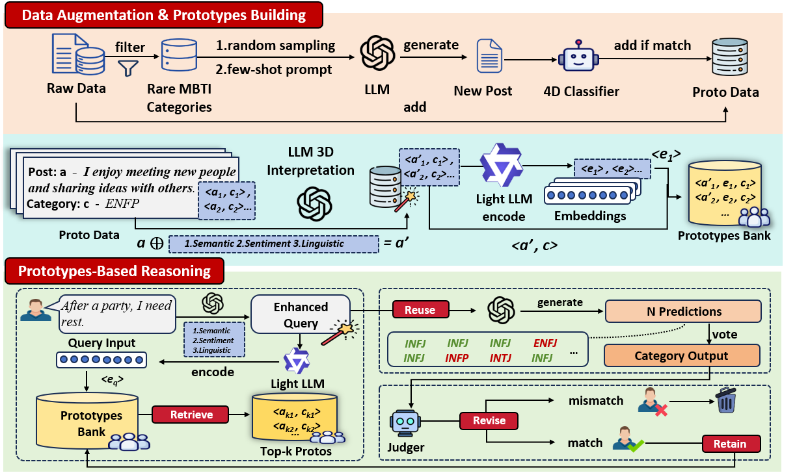

# ProtoMBTI: Prototype-Guided Retrieval-Augmented Reasoning for MBTI Inference from Text



This repository contains the code implementation for the paper "ProtoMBTI: Prototype-Guided Retrieval-Augmented Reasoning for MBTI Inference from Text". The project focuses on personality type classification using the Myers-Briggs Type Indicator (MBTI) framework, leveraging prototype-based reasoning techniques to align with cognitive psychology principles.

## Project Overview

Understanding a user's personality is crucial for personalized AI, and the MBTI provides a widely recognized operational framework for personality modeling. Existing text-based MBTI prediction methods often treat labels as fixed categories, neglecting the prototype-based nature of personality emphasized in cognitive psychology.

This project implements ProtoMBTI, a novel prototype-based reasoning framework for MBTI inference from social-media text that addresses these limitations by aligning LLM inference with the cognitive structure of personality via prototype retrieval-driven reasoning. Key features include:

- Construction of a balanced, high-quality prototype library that captures the essence of each MBTI type
- Implementation of the retrieve–reuse–revise–retain reasoning cycle during inference
- Achievement of accurate, interpretable, and transferable predictions
- Significant performance improvements over neural and LLM baselines on standard benchmarks

The project includes comprehensive tools for data processing, prototype management, model training, evaluation, and visualization.

## Paper Information

**Title**: ProtoMBTI: Prototype-Guided Retrieval-Augmented Reasoning for MBTI Inference from Text

**Abstract**: Understanding a user's personality is crucial for personalized AI, and the MBTI provides a widely recognized operational framework for personality modeling. Existing text-based MBTI prediction methods often treat labels as fixed categories, neglecting the prototype-based nature of personality emphasized in cognitive psychology. To address this, we propose **ProtoMBTI**, a prototype-based reasoning framework for social-media text: it aligns LLM inference with the cognitive structure of personality via prototype retrieval-driven reasoning. Specifically, ProtoMBTI constructs a balanced, high-quality prototype library and performs a retrieve–reuse–revise–retain cycle during inference to achieve accurate, interpretable, and transferable predictions. On the Kaggle (85.14%) and Pandora (71.41%) benchmarks, ProtoMBTI significantly outperforms neural and LLM baselines, and under distribution shift achieves an average accuracy of 96.41% on the Pandora test set, covering all 16 MBTI types.

## Environment Setup

### Option 1: Using conda (recommended)
1. Ensure you have Anaconda or Miniconda installed
2. Create a new environment from the requirements.yml file:
   ```bash
   conda env create -f requirements.yml
   ```
3. Activate the environment:
   ```bash
   conda activate mbti
   ```

### Option 2: Using Python virtual environment
1. Create a virtual environment:
   ```bash
   python -m venv venv
   ```
2. Activate the environment:
   - Windows: `venv\Scripts\activate`
   - Linux/Mac: `source venv/bin/activate`
3. Install dependencies:
   ```bash
   pip install pandas numpy scikit-learn transformers peft torch tqdm ijson matplotlib requests faiss-cpu jupyter
   ```

## Project Structure

### Key Files

#### Data Processing
- `data_process.ipynb`: Data cleaning and preprocessing pipeline
- `clean_aug_data.ipynb`: Cleaning augmented data
- `pandora_process.ipynb`: Processing Pandora dataset

#### Data Augmentation
- `data_augmentation.py`: LLM-based data augmentation for MBTI types
- `4_embeddings_with_explain.ipynb`: Embeddings with explainability features

#### Model Training
- `train_model.ipynb`: Model training pipeline
- `multi_model.ipynb`: Multi-model comparison and training
- `xiaorong.ipynb`, `xiaorong2.ipynb`: Additional model training notebooks

#### Evaluation and Testing
- `test&draw.ipynb`: Testing and visualization
- `test_kaggle.ipynb`: Kaggle dataset testing
- `4_models_with_duibi.ipynb`: Model comparison analysis
- `XR3_test.ipynb`: XR3 model testing

#### Analysis
- `data_explain.py`: Data explanation and analysis
- `CBR-LLM.ipynb`: Case-based reasoning with LLM
- `statistics.ipynb`: Statistical analysis

## Running Experiments

### 1. Data Preparation
First, process and prepare the input data:
- Run `data_process.ipynb` to clean and preprocess the raw data
- Optionally run `data_augmentation.py` to generate augmented data if needed:
  ```bash
  python data_augmentation.py
  ```
- Note: You'll need to configure your API key in the script for data augmentation

### 2. Model Training
Choose one of the training notebooks to train your model:
- `train_model.ipynb`: Basic model training
- `multi_model.ipynb`: Compare multiple models
- `xiaorong.ipynb`: Advanced model training with additional features

To run a notebook:
```bash
jupyter notebook <notebook_name>.ipynb
```

### 3. Evaluation
After training, evaluate the model using:
- `test&draw.ipynb`: Generate performance metrics and visualizations
- `4_models_with_duibi.ipynb`: Compare model performance
- `XR3_test.ipynb`: Test with specific XR3 model

### 4. Analysis
- Use `data_explain.py` to get detailed explanations of the results
- Run `statistics.ipynb` for statistical analysis of the data
- Explore `CBR-LLM.ipynb` for case-based reasoning with LLM integration

## Configuration

### API Keys
For data augmentation, you'll need to provide API keys in the following files:
- `data_augmentation.py`: Line 420 - Set your API key
- `data_explain.py`: Line 247 - Set your API key

### Model Parameters
Key parameters can be adjusted in the respective notebooks:
- Batch size, learning rate, and epochs in training notebooks
- Model architecture selections
- Augmentation parameters in `data_augmentation.py`

## Results

ProtoMBTI demonstrates state-of-the-art performance on MBTI personality inference:

**Benchmark Results:**
- **Kaggle Dataset**: 85.14% accuracy
- **Pandora Dataset**: 71.41% accuracy
- **Under Distribution Shift**: 96.41% average accuracy on the Pandora test set, covering all 16 MBTI types

The project generates various output files:
- `train.json`, `val.json`, `test.json`: Split datasets
- Model checkpoints in respective directories
- Visualizations (confusion matrices, ROC curves, etc.)
- Augmented data in `augmented_data/` directory

## Notes

1. **Memory Requirements**: Training large language models requires significant GPU memory. Ensure you have sufficient resources.
2. **API Usage**: Data augmentation uses external APIs which may incur costs.
3. **Reproducibility**: All random seeds are set to 42 for reproducibility.
4. **Data Privacy**: Ensure you have appropriate permissions for any external data used.

## Troubleshooting

- **Missing Dependencies**: Ensure all packages are installed correctly using the requirements.yml file
- **GPU Issues**: If CUDA is not available, models will run on CPU but may be slower
- **API Errors**: Check your API keys and network connectivity
- **Notebook Issues**: Ensure Jupyter is installed and kernels are properly configured

## License

This project is intended for academic research purposes.

## Contact

For questions or issues, please contact the project maintainer.
